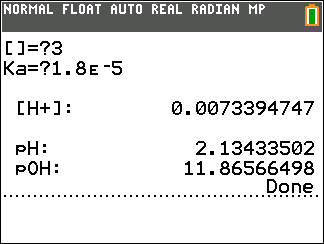
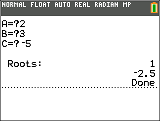
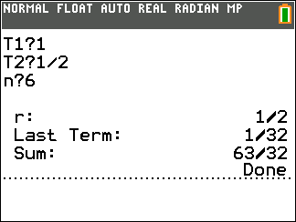
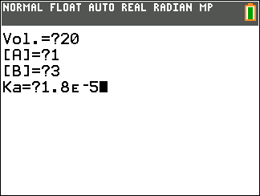
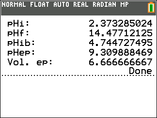
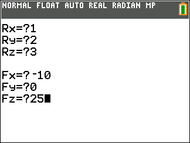
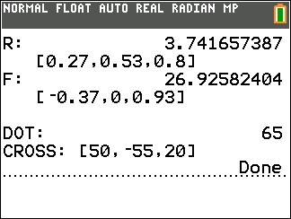
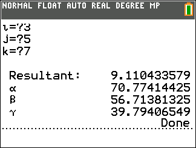

# TI-84-prgms
This is a collection of various simple programs I have created throughout high school and university that for the most part are just multivariable functions that perform lots of arithmetic and save time.
  
# CONSTANT.8xp
Stores various fundamental constants to the ALPHA variables for easy access. Performed as a final subroutine for the other programs that write to these variables so you don't lose them.

# DRAWINV.8xp
­­Hides functions and re-plots them as inverse functions. $\big(x=f(y)$ instead of default $y=f(x)\big)$
#### Usage:
Enter function in **Y3** or **Y4** variable and run program.

# PH.8xp
Finds the pH, pOH, and ion concentration of a sample.
#### Usage:
Enter the molarity of an acid (or the negative of the molarity for a base) and the the acid dissociation constant ($\text K_a$).

# QUAD.8xp
Simple quadratic root solver for coeffients $Ax^2 + Bx + C = 0$.

# SERIES.8xp
Finds $t_n$ , $S_n$ , and $r$ of a geometic series.
#### Usage:
Enter the value of the first term, the value of the second term, and the number of terms. If you want to find $t_\infty$ and $S_\infty$ , enter the number of terms as `0`.

# TITRATE.8xp
Finds the pH at significant points along a titration curve for the titration of a weak acid with a strong base for monoprotic, diprotic, and triprotic acids.
#### Usage
Select the number of ionizations, enter the volume of acid in mL, molarity of acid, molarity of base, and the acid dissociation constant ($\text K_a$).

| Output        | Meaning                                         |
|---------------|-------------------------------------------------|
| `pHi:`        | initial pH                                      |
| `pHf:`        | final pH                                        |
| `pHib:`       | pH when the solution acts as an ideal buffer    |
| `pHep:`       | pH at the equivalence point                     |
| `Vol. ep:`    | volume of base (in mL) at the equivalence pt    |

# VECOPS.8xp
Finds magnitudes, unit vectors, and dot and cross products of two vectors $\vec{\text R}$ and $\vec{\text F}$. Particularity useful for finding reaction moments.
#### Usage:
Enter $x, y, z$ components for each vector.

# VECTOR.8xp
Finds the $\alpha$, $\beta$, and $\gamma$ angles of a vector.
#### Usage:
Enter $\hat\imath, \hat\jmath, \hat k$ components.

